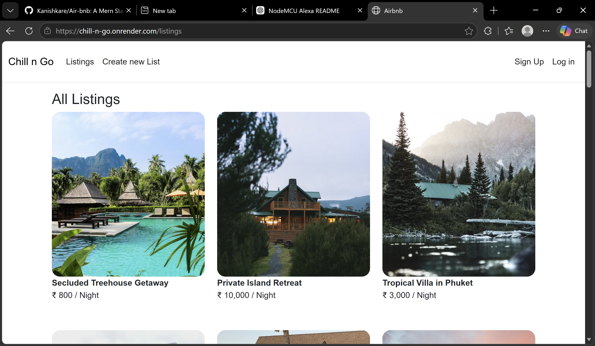
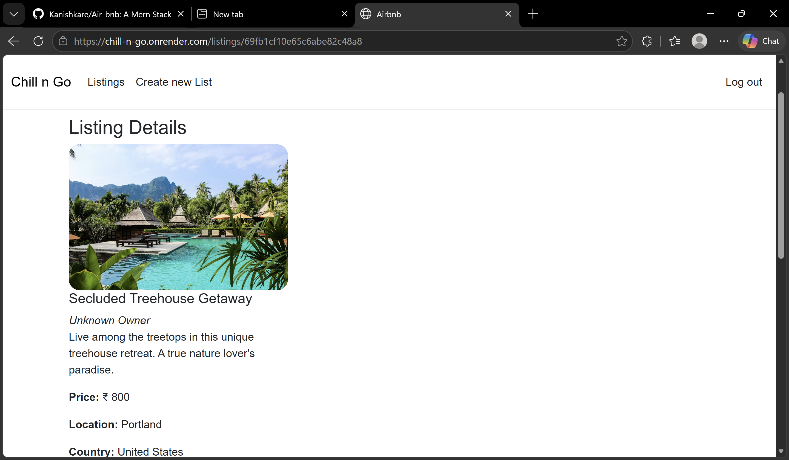
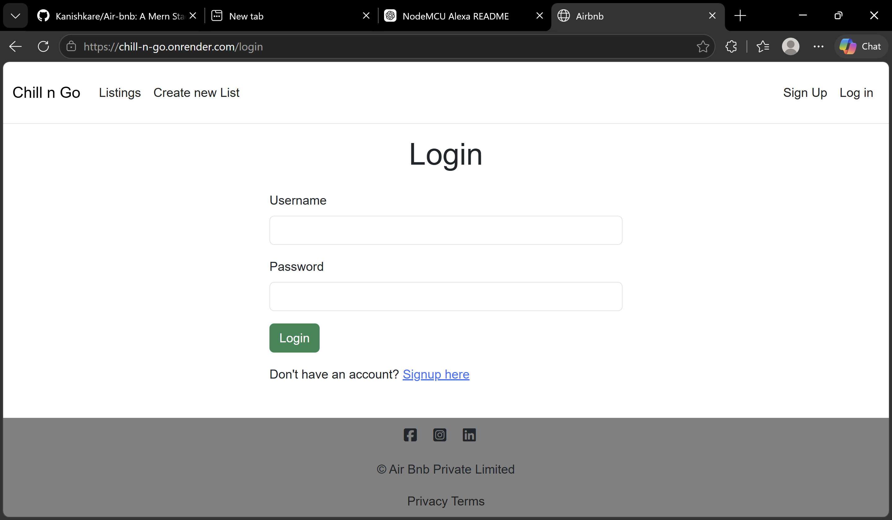
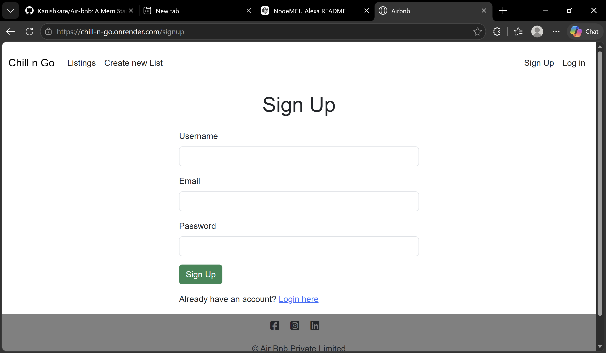
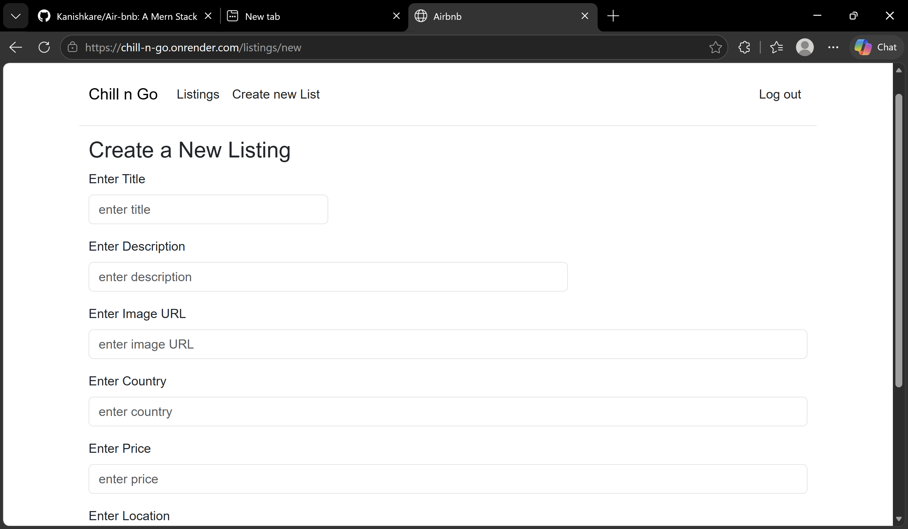
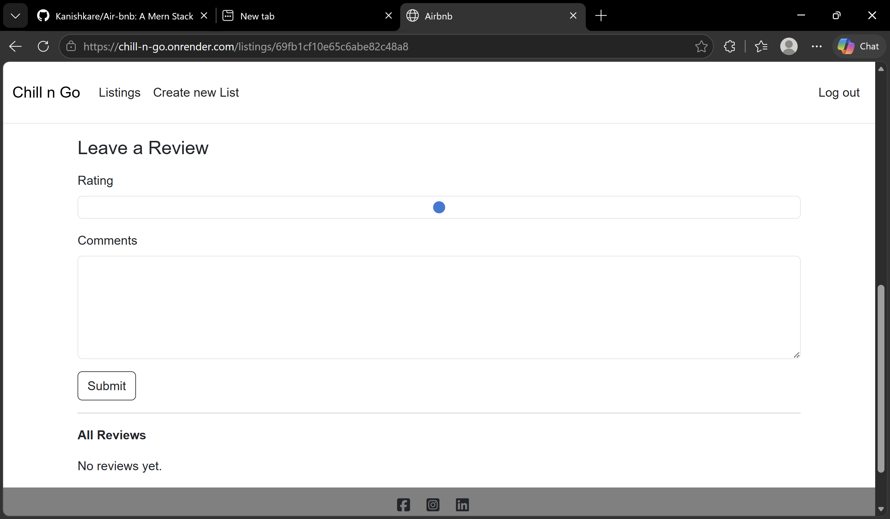

# Chill N Go 🏡✈️

Chill N Go is a full-stack stay booking and listing platform inspired by Airbnb.
Users can explore available stays, view property details, create listings, and review places.

This project was built completely from scratch to understand how backend systems work, including authentication, authorization, routing, CRUD operations, and database integration.

## Live Demo

[Chill N Go Live Website](https://chill-n-go.onrender.com?utm_source=chatgpt.com)

---

# Features

* Browse available stays and listings
* View detailed information about properties
* User Signup & Login Authentication
* Authorization for protected actions
* Create new property listings
* Add and manage stay details
* Review and rating functionality
* Responsive and clean UI
* Backend CRUD operations
* MongoDB database integration

---

# Tech Stack

## Frontend

* HTML
* CSS
* JavaScript
* EJS Templates

## Backend

* Node.js
* Express.js

## Database

* MongoDB
* Mongoose

## Authentication

* Passport.js Authentication
* Authorization Middleware
* Session Handling

---

# Why I Built This Project

I built this project completely from scratch to understand how backend development works in real-world applications.

While building this project, I learned:

* RESTful routing
* Backend architecture
* Authentication & authorization
* Database schema design
* CRUD operations
* Session management
* Full-stack application flow
* Deploying applications using Render

This is not a vibe-coded project.
The main goal was to deeply understand backend development by implementing features manually.

---

# Main Functionalities

## User Authentication

* Secure Signup and Login system
* Session-based authentication
* Protected routes for authorized users

## Listings Management

Users can:

* Add new stays
* View all listings
* View listing details
* Manage listing information

## Reviews System

Users can:

* Add reviews for places
* Check stay experiences
* Interact with property listings

---

## Screenshots

### Homepage


### Listings


### Login


### Signup


### Create Listing


### Review Page


# Folder Structure

```bash
Chill-N-Go/
│
├── models/
├── routes/
├── views/
├── public/
├── controllers/
├── middleware/
├── utils/
├── app.js
├── package.json
└── README.md
```

---

# Installation

## Clone Repository

```bash
git clone <your-github-repo-link>
```

---

## Navigate to Project

```bash
cd chill-n-go
```

---

## Install Dependencies

```bash
npm install
```

---

## Setup Environment Variables

Create a `.env` file and add:

```env
ATLASDB_URL=your_mongodb_url
SECRET=your_secret_key
```

---

## Run the Server

```bash
node app.js
```

or

```bash
nodemon app.js
```

---

# Deployment

The project is deployed using Render.

---

# Challenges Faced

* Understanding backend request flow
* Implementing authentication properly
* Managing sessions and authorization
* Designing MongoDB schemas
* Connecting frontend with backend routes
* Handling CRUD operations

---

# Future Improvements

* Image upload using Cloudinary
* Booking functionality
* Payment integration
* Search and filters
* Maps integration
* User profile management
* Wishlist feature

---

# Learning Outcomes

This project helped me improve:

* Full-stack development skills
* Backend architecture understanding
* Express.js routing
* MongoDB integration
* Authentication systems
* Problem-solving and debugging

---

# Author

Developed by Kanishka 💻
